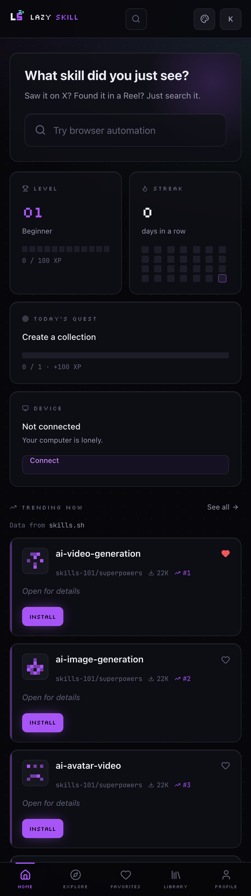
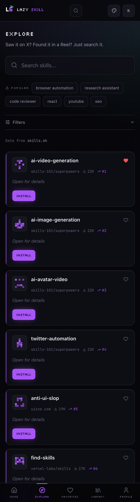
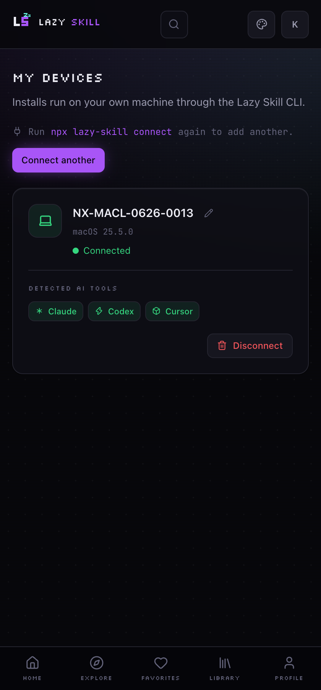
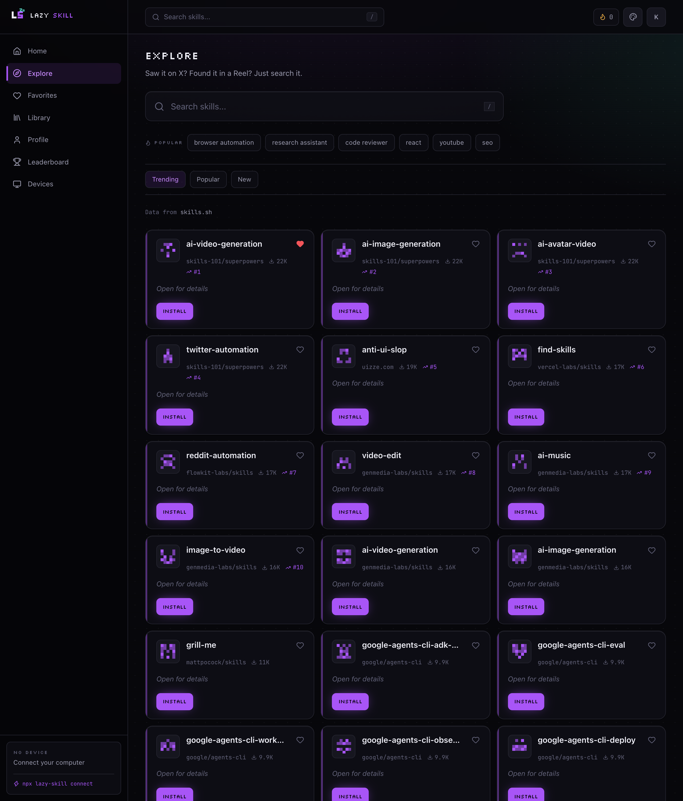
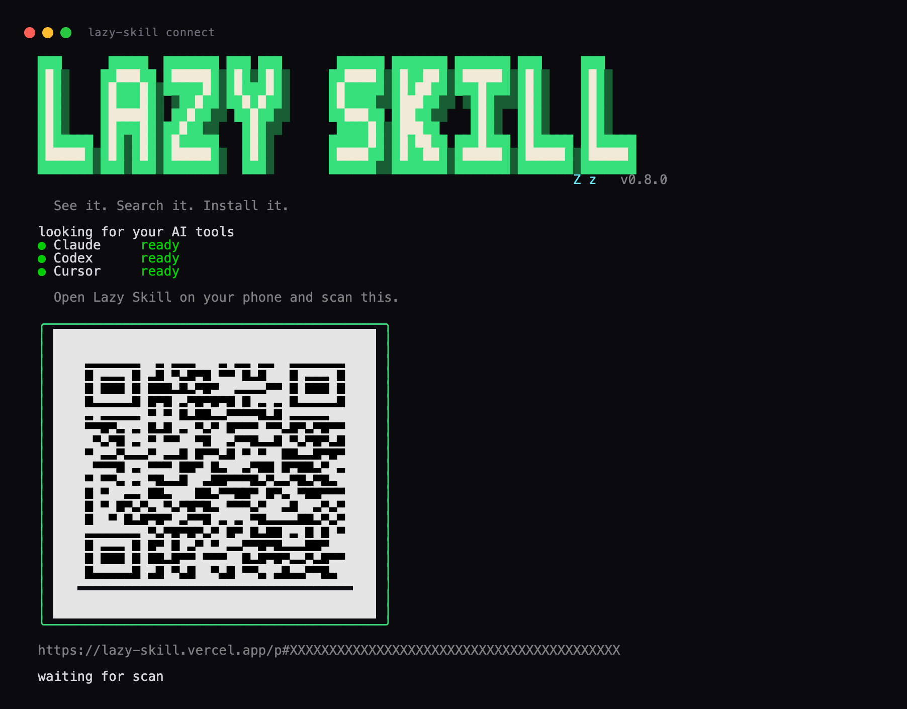
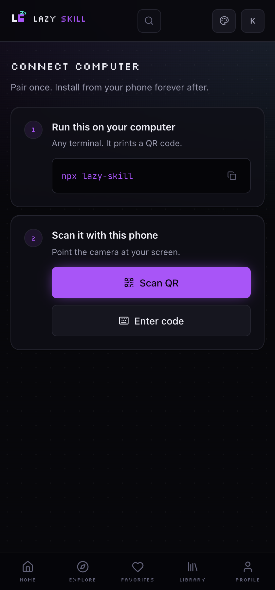
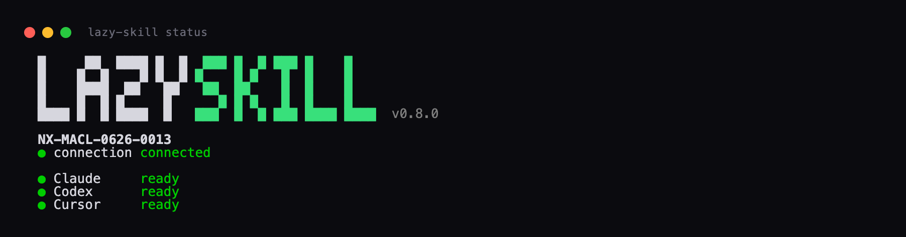
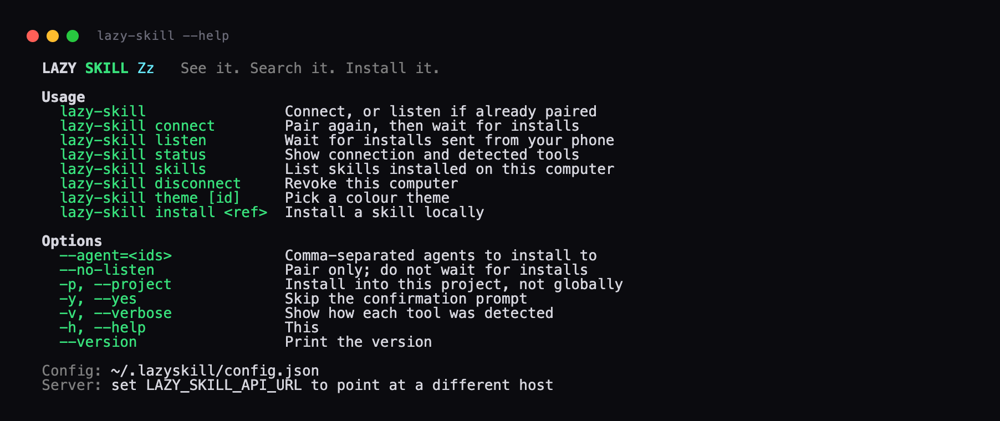

# Lazy Skill

**See it. Search it. Install it.**

You spot an AI agent skill while scrolling. Instead of hunting for the repo,
the README, and the install command buried in step four, you search it on your
phone and send it to your laptop. The laptop installs it.

Live at **[lazy-skill.vercel.app](https://lazy-skill.vercel.app)** · CLI on npm
as **[`lazy-skill`](https://www.npmjs.com/package/lazy-skill)**

---

## The phone

<p align="center">
  
  &nbsp;
  
</p>

Search, favourite, collect, and install to a named computer. Level, streak and
daily quest are real — points only land when the thing they are for actually
happened, and the database refuses an award it cannot verify.

<p align="center">
  
  &nbsp;
  
</p>

On a wider screen it becomes a sidebar layout — same data, no separate build.



## The terminal

One command on the laptop. It finds your agents, shows a QR code, and waits.



The phone side of the same moment. A signed-in account with no computer sees
this and nothing else — connecting is the one thing a new account has to do, so
the app does not pretend otherwise.

<p align="center">
  
</p>

The wordmark, the QR and the colours are the real output — these images are
rendered from captured ANSI, not mocked up. The theme is chosen once and shared:
pick it in the terminal and the phone adopts it during pairing.





## How it fits together

```
phone                     server                    laptop
─────                     ──────                    ──────
tap install  ──────────▶  queue a job
                          (validated skill ref)
                                    ◀──────────────  poll for work
                                    ──────────────▶  run the installer
                          record per-agent  ◀──────  report each stage
                          outcome
watch it land ◀─────────  realtime + polling
```

The laptop never accepts a command. It asks whether a job exists, and a job can
only ever be `INSTALL_SKILL` with a skill reference the server already checked
against a strict pattern. There is no remote shell here, by construction.

## Run it locally

```bash
pnpm install
cp .env.example .env.local   # then fill it in — the file explains each value
pnpm dev
```

Opens on http://localhost:3000. The registry needs a Vercel OIDC token, which
`pnpm dlx vercel link && pnpm dlx vercel env pull` writes into `.env.local`
once OIDC Federation is enabled for the project.

The CLI:

```bash
cd cli && pnpm build && node dist/index.js
```

## Where things live

```
src/app/                 routes — (app) is the signed-in shell, / is marketing
src/proxy.ts             session refresh, and the sign-in + connect gates
src/lib/providers/       the only place that knows where skill data comes from
src/lib/pairing/         codes, device tokens, rate limiting
src/lib/gamification/    XP rules, mirrored in SQL as the actual authority
src/lib/themes.ts        the 7 themes; ids are shared with the CLI when pairing
src/types/skill.ts       domain model — unknown fields are null, never guessed
supabase/migrations/     schema, RLS policies, and the reward functions
cli/src/adapters/        the trust boundary: what may be handed to an installer
cli/src/ui/              banner, QR, theme picker, spinner
```

## Rules the code holds to

**Nothing is invented.** Install counts, compatibility and audit results are
`null` when the source did not report them, and the UI shows "—" rather than a
plausible default. When the registry cannot be reached, pages come back empty
and say so — they used to be filled with sample skills, which is worse than
showing nothing, because a page of plausible skills that do not exist is a lie
the reader cannot detect.

**The database decides rewards, not the client.** XP amounts, quest targets and
achievement codes live in SQL. The client says only what happened, and the
award is refused unless a matching favourite, collection or installation exists
for that user. A security review found the earlier design gave 2,500 XP and the
top leaderboard place to twenty-five calls with invented ids.

**The install path is a fixed vocabulary.** A skill reference is validated
against a strict pattern, then passed as a single argv element after `--` to a
pinned installer version, with `shell: false`. `cli/test/install-plan.test.mjs`
is weighted toward what must be refused.

**Duplication is deliberate where it is a boundary, and tested.** The reward
rules and the CLI contract each exist twice on purpose, and a drift test fails
the build if the copies disagree.

## Tests

```bash
pnpm test          # levels, pairing codes, contract drift, reward drift, CLI
pnpm lint
pnpm build
node scripts/check-csp.mjs      # loads the live site, looks for CSP violations
node scripts/measure-perf.mjs   # throttled 4G timings against production
```

## Stack

Next.js 16 (App Router) · React 19 · TypeScript strict · Tailwind 4 ·
Supabase (Postgres, Auth, RLS, realtime) · Vercel, in `bom1` beside the
database · Node CLI published to npm

Sign-in is GitHub or Google. Email links are written and switched off behind
one flag in `src/lib/auth-options.ts`, waiting on a domain to send from.
